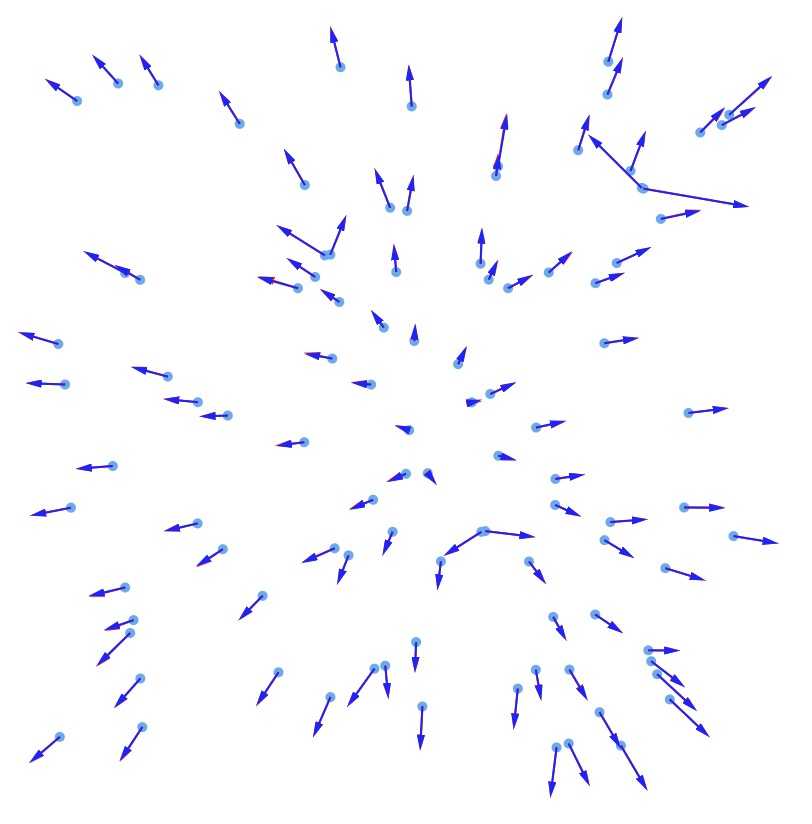

# force-n-body

Force-n-body algorithm with Barnes-Hut Algorithm acceleration.



## API

* `nodes`: nodes to compute forces
* `weightFunc`: each node's weight specifying function, default is `() => 30`
* return: force vectors array

```ts
function forceNBody(
  nodes: { x: number; y: number }[],
  weightFunc?: (node?: { x: number; y: number }) => number
): { vx: number; vy: number }[];

function forceNBodyBruteForce(
  nodes: { x: number; y: number }[],
  weightFunc?: (node?: { x: number; y: number }) => number
): { vx: number; vy: number }[];
```


## Reference

> 1. http://arborjs.org/docs/barnes-hut
> 2. https://github.com/d3/d3-force